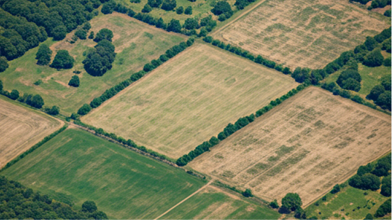
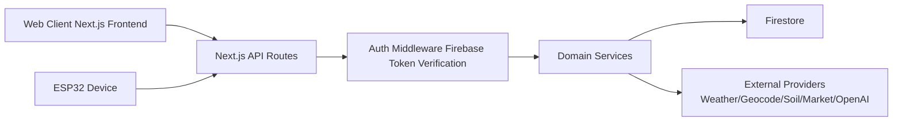
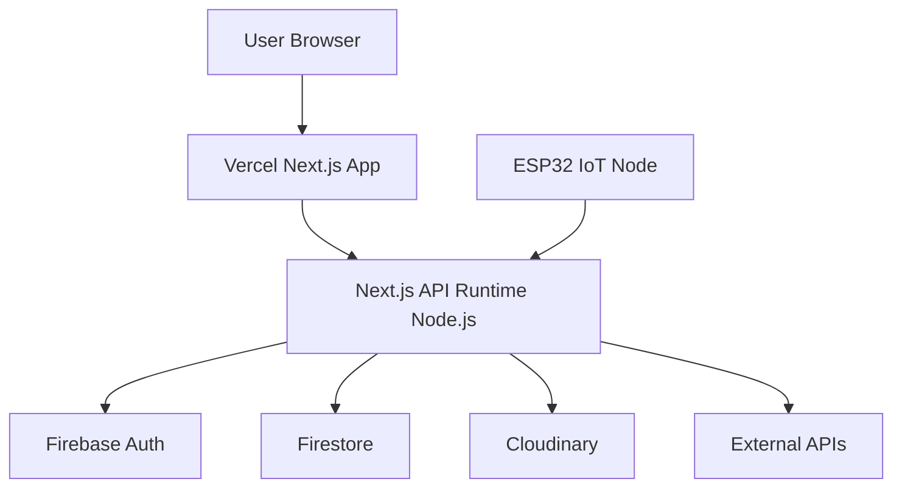

# PiliSeed

<details>
<summary>Table of Contents</summary>

- [PiliSeed](#piliseed)
- [Introduction](#introduction)
- [Our Target SDG Goals](#our-target-sdg-goals)
- [Features](#features)
- [Getting Started](#getting-started)
- [User Guide](#user-guide)
- [Project Architecture](#project-architecture)
- [SYSTEM ARCHITECTURE](#system-architecture)
- [API DOCUMENTATION](#api-documentation)
- [DATABASE SCHEMA](#database-schema)
- [DEPLOYMENT DIAGRAM](#deployment-diagram)
- [Libraries](#libraries)
- [Data Sources and Integrations](#data-sources-and-integrations)
- [Project Documentation](#project-documentation)
- [Firmware](#firmware)
- [Contributors](#contributors)

</details>

## Introduction

PiliSeed is a smart agriculture advisory platform that combines farm context, weather signals, soil analysis, market context, and AI-assisted reasoning to support better crop planning decisions.

The backend is built as a Next.js App Router API with Firebase Auth and Firestore, deterministic analysis logic, and optional AI generation for explanations. The frontend provides public and authenticated experiences for farm onboarding, monitoring, and recommendation review.

### Our Target SDG Goals

PiliSeed supports practical outcomes aligned with:

- SDG 2: Zero Hunger
- SDG 12: Responsible Consumption and Production
- SDG 13: Climate Action

## Features

#### 1. Authentication and Profile Management

Secure sign-up, login, and profile management powered by Firebase Auth with protected API contracts for user profile retrieval and updates.

#### 2. Farm Management and Activation

Users can create, update, delete, and activate farms. Farm activation drives the active context for dashboard and analytics endpoints.

#### 3. Location Intelligence (Geocode and Reverse Geocode)

Address-to-coordinate and coordinate-to-address endpoints normalize location context before downstream weather and soil analysis.

#### 4. Weather Monitoring and Forecasting

Farm-scoped weather endpoints support current weather, forecast timeline, and refresh operations with normalized snapshots for downstream scoring.

#### 5. Soil Profiles and SoilGrids Classification

Soil profiles support manual and API-backed workflows. Soil classification uses ISRIC SoilGrids WRB outputs and persists classification metadata with probabilities.

#### 6. Crop Recommendation Engine

Recommendations use deterministic scoring first, with optional AI generation for richer explanation text. Session-aware recommendation history is supported.

#### 7. Yield Prediction and Revenue Estimation

Yield forecasts combine farm context with soil, weather, and optional market signals, then persist results for dashboard reporting.

#### 8. Dashboard Summary, Analytics, and Activity

Dashboard APIs return summary cards, chart-ready trend series, and timeline activity events across weather, soil, recommendations, and yield.

#### 9. IoT Device Integration (ESP32)

Firmware for ESP32 + DHT22 + soil moisture + LDR + OLED sends farm readings to backend endpoints and displays top crop recommendations.

#### 10. Secure API and Firestore Ownership Model

Protected API groups are validated through token middleware, and Firestore rules enforce user ownership across farm-scoped documents.

## Getting Started

> [!IMPORTANT]
> This project requires Firebase configuration and server-side credentials to run authenticated APIs.

1. Clone this repository.
2. Install dependencies:

```bash
npm install
```

3. Create your local environment file from the template:

```bash
cp .env.example .env
```

4. Fill required values in .env:
- NEXT_PUBLIC_FIREBASE_API_KEY
- NEXT_PUBLIC_FIREBASE_AUTH_DOMAIN
- NEXT_PUBLIC_FIREBASE_PROJECT_ID
- NEXT_PUBLIC_FIREBASE_STORAGE_BUCKET
- NEXT_PUBLIC_FIREBASE_MESSAGING_SENDER_ID
- NEXT_PUBLIC_FIREBASE_APP_ID
- FIREBASE_ADMIN_PROJECT_ID
- FIREBASE_ADMIN_CLIENT_EMAIL
- FIREBASE_ADMIN_PRIVATE_KEY
- CLOUDINARY_CLOUD_NAME
- CLOUDINARY_API_KEY
- CLOUDINARY_API_SECRET

5. Start development server:

```bash
npm run dev
```

6. Open http://localhost:3000

7. Validate code quality before commits:

```bash
npm run lint
npm run build
```

## User Guide

### Public Page: Landing (/)

| Mobile | Guide |
| --- | --- |
|  | Entry page for product overview, problem framing, and navigation to login/signup and feature pages. |

### Public Page: About (/about)

| Mobile | Guide |
| --- | --- |
|  | Presents team, product context, and background details for PiliSeed. |

### Public Page: Features (/features)

| Mobile | Guide |
| --- | --- |
|  | Shows major product capabilities and value propositions in feature cards. |

### Public Page: How It Works (/how-it-works)

| Mobile | Guide |
| --- | --- |
|  | Explains the end-to-end flow from data input to recommendations and monitoring. |

### Public Page: Login (/login)

| Mobile | Guide |
| --- | --- |
|  | Authenticates users through Firebase-backed sign-in flow before private feature access. |

### Public Page: Signup (/signup)

| Mobile | Guide |
| --- | --- |
|  | Registers new users and creates the initial profile scaffold for farm onboarding. |

### Private Tab: Dashboard (/dashboard)

| Mobile | Guide |
| --- | --- |
|  | Aggregates summary insights across weather, soil, recommendations, and yield for the active farm. |

### Private Tab: Farms (/farms)

| Mobile | Guide |
| --- | --- |
|  | Manage farm records, location details, and active farm selection used by analytics and dashboard APIs. |

### Private Tab: Recommendations (/recommendations)

| Mobile | Guide |
| --- | --- |
|  | Displays ranked crops, recommendation analysis text, warning flags, and latest session output. |

### Private Tab: Weather (/weather)

| Mobile | Guide |
| --- | --- |
|  | Visualizes current and forecast weather signals that feed recommendation and yield context. |

### Private Tab: Yield (/yield)

| Mobile | Guide |
| --- | --- |
|  | Presents expected yield and revenue signals derived from soil, weather, and market context. |

### Private Tab: Profile (/profile)

| Mobile | Guide |
| --- | --- |
|  | Allows user profile updates including identity details and profile image management. |

### Private Tab: Parameters (/parameters)

| Mobile | Guide |
| --- | --- |
|  | Hosts configurable preferences and operational parameters used by private workflows. |

### Private Tab: History (/history)

| Mobile | Guide |
| --- | --- |
|  | Displays historical activity and recommendation sessions for longitudinal review. |

## Project Architecture


High-level backend flow:

auth -> ownership validation -> input validation -> provider normalization -> deterministic scoring -> optional AI explanation -> Firestore persistence -> API response envelope

## SYSTEM ARCHITECTURE



## API DOCUMENTATION

Main route groups:

- Auth: /api/auth/login, /api/auth/signup, /api/auth/logout, /api/auth/me
- Profile and upload: /api/profile, /api/upload/profile-image
- Farms: /api/farms and /api/farms/[farmId] with activate, soil, weather, market, recommendations, and yield sub-routes
- Dashboard: /api/dashboard/summary, /api/dashboard/analytics, /api/dashboard/activity
- Location: /api/location/geocode, /api/location/reverse
- Legacy compatibility (protected placeholders): /api/soil/[farmId], /api/soil/[farmId]/latest

For full JSON contracts, see docs/backend/API JSON Input Output Summary.md

## DATABASE SCHEMA

Primary Firestore collections and relationships:

- users: user profile root records
- farms: farm metadata, ownership, active-state context
- farmDevices: IoT device links and activation/readings state
- soilProfiles: manual/API/device soil records with classification and analysis JSON
- weatherSnapshots: weather records used for dashboard/recommendation context
- cropRecommendations: recommendation sessions and ranked crops
- yieldForecasts: expected yield and revenue projections
- marketSnapshots: normalized commodity snapshots

Ownership model:

- Every farm-scoped document stores uid and farmId
- API layer validates ownership per request
- firestore.rules enforces read/write ownership server-side

## DEPLOYMENT DIAGRAM



## Libraries

- Next.js 16
- React 19
- TypeScript 5
- Firebase + Firebase Admin
- Zod
- Cloudinary
- Framer Motion
- Recharts
- Lucide React
- Sonner
- Tailwind CSS 4

## Data Sources and Integrations

- Firebase Auth and Firestore
- Cloudinary (profile image uploads)
- Open-Meteo weather endpoints (default)
- Open-Meteo geocoding + reverse geocoding fallback support
- ISRIC SoilGrids WRB classification endpoints
- Configurable market provider endpoints
- OpenAI-compatible responses endpoint for AI explanations


## Firmware

Firmware files are located in firmware/.

- firmware/esp32.ino: ESP32 sketch for sensor capture and recommendation display
- firmware/config.h.example: credentials and backend endpoint template

Workflow summary:

1. ESP32 reads moisture, temperature, humidity, and light.
2. Device sends readings to /api/farms/[farmId]/soil/device/readings.
3. Device checks activation/request endpoints and displays top recommendations on OLED.

## Contributors

PiliSeed Team
| Name | Username | Role |
| --- | --- | --- |
| ERSANDO, Aaron Gabriel | CPE3B-ersando-aarongabriel | Project Manager and Backend Developer |
| CAGARA, Josh "Lendi" Lendl | aysi19 | Quality Assurance and Frontend Developer |
| FABROS, Adrian Jude | Adrian-Fab | Web Design and Frontend Developer|
| NAVARRO, Francine Nicole | kuulaid | Backend Developer and Resident |
| VILLANUEVA, Kie Sha | CPE3B-villanueva-kiesha | Web Design and Frontend Developer |


