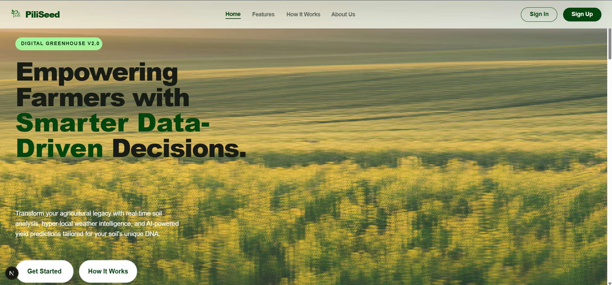

**PiliSeed Frontend Documentation: Public Pages**


## 💡Introduction
PiliSeed is a web-based agricultural intelligence platform designed to help farmers make smarter, data-driven decisions. By combining location data, real-time weather information, and soil conditions, PiliSeed provides personalized crop recommendations, risk assessments, and actionable farming insights.

The problem we address is that many farmers rely on generalized advice that does not account for local environmental conditions. This often leads to poor crop selection, reduced yields, and increased vulnerability to climate risks. PiliSeed simplifies decision-making by delivering precise, localized recommendations powered by artificial intelligence.

---

##  User Journey Overview
- User lands on the Home page via direct link or search engine.
- Explores features, how it works, and about pages.
- Decides to sign up or log in.
- Navigates through public pages using the navigation bar.
- Receives feedback and guidance at every step.

---

##  Home (Landing) Page

## Purpose
The Home (Landing) page is the first point of contact for all users visiting PiliSeed. It introduces the platform, communicates its value proposition, and guides users to key actions such as logging in, signing up, or learning more about features. The design is welcoming, visually engaging, and optimized for both new and returning users.

---

## UI Elements
- **Hero Section:** Prominent branding, tagline, and a visually appealing background or illustration related to smart agriculture.
- **Feature Highlights:** Brief, icon-based or card-based summaries of PiliSeed’s main features (e.g., farm management, weather insights, crop recommendations).
- **Call-to-Action Buttons:** Clear buttons for Login, Signup, and Learn More, placed above the fold.
- **Navigation Bar:** Persistent top navigation with links to public pages (About, Features, How It Works, Login, Signup).
- **Footer:** Contact information, social media links, and legal notices.
- **Responsive Design:** Layout adapts gracefully to mobile, tablet, and desktop screens.

---

## User Flow
1. **Arrival:** User lands on the Home page via direct link or search engine.
2. **First Impression:** The hero section communicates the platform’s mission and value.
3. **Exploration:** User scrolls to see feature highlights and supporting visuals.
4. **Action:** User clicks Login or Signup to access personalized features, or Learn More to read about PiliSeed’s capabilities.
5. **Navigation:** User can access About, Features, or How It Works for more information.

---

## UX & Design Notes
- **Clarity:** Messaging is concise and focused on the benefits to farmers and stakeholders.
- **Visual Appeal:** Use of agricultural imagery, green color palette, and clean typography.
- **Accessibility:** All interactive elements are keyboard-navigable and have appropriate ARIA labels.
- **Performance:** Optimized images and minimal initial load for fast first paint.
- **Trust:** Includes visible links to About and contact information to build credibility.

---

## Layout 



---

## Technical Notes
- Built with Next.js and TypeScript for fast, SEO-friendly rendering.
- Uses global CSS for consistent theming.
- Navigation links use client-side routing for smooth transitions.

---

## Best Practices
- Keep the call-to-action visible and prominent.

# PiliSeed Frontend Documentation: Private (Authenticated) Side

---

## Table of Contents
1. Introduction
2. Authenticated User Journey Overview
3. Dashboard Page
4. Farms Management
5. Profile Page
6. Recommendations Page
7. Soil Analysis Page
8. Weather Insights Page
9. Yield Prediction Page
10. Navigation & Layout
11. API Integration & Data Flow
12. Error Handling & Feedback
13. Accessibility & Responsiveness
14. Security Considerations
15. Best Practices & Developer Notes
16. Example User Scenarios
17. Appendix: Component & File Structure

---

## 1. Introduction

The private side of PiliSeed is accessible only to authenticated users (farmers, agronomists, or admins). It provides a comprehensive suite of tools for farm management, personalized recommendations, analytics, and actionable insights. This documentation details the step-by-step user journey, technical implementation, UI/UX patterns, accessibility, and best practices for all private pages.

---

## 2. Authenticated User Journey Overview

1. **Login:** User authenticates via secure login form.
2. **Landing:** Redirected to the Dashboard upon successful login.
3. **Navigation:** Uses sidebar or navbar to access Farms, Profile, Recommendations, Soil, Weather, and Yield pages.
4. **Farm Management:** Adds, edits, or deletes farm records.
5. **Profile Management:** Updates personal info, password, and preferences.
6. **Data Input:** Inputs or updates soil and farm data.
7. **Insights:** Receives personalized recommendations, weather forecasts, and yield predictions.
8. **Logout:** Ends session securely.

---

## 3. Dashboard Page

### Purpose
The Dashboard is the central hub for authenticated users, summarizing key metrics, recent activity, weather, yield predictions, and actionable recommendations.

### UI Elements
- **Header:** User greeting, quick stats, and notifications.
- **Farm Summary:** List of user’s farms with quick access links.
- **Weather Widget:** Current weather and forecast for selected farm.
- **Yield Prediction:** Visual chart of predicted yields.
- **Recommendations:** Top actionable insights for the week.
- **Recent Activity:** Timeline of user actions and system updates.
- **Sidebar Navigation:** Persistent, collapsible sidebar for quick access to all private pages.
- **Footer:** Legal, support, and version info.

### User Flow (Step-by-Step)
1. User logs in and is redirected to the Dashboard.
2. Dashboard loads user profile and farm data via API.
3. Weather widget fetches current and forecast data for the default or last-viewed farm.
4. Yield prediction chart visualizes upcoming harvest expectations.
5. Recommendations section displays prioritized actions (e.g., “Irrigate Farm A today”).
6. User clicks on a farm to view details or manage data.
7. User can navigate to other pages via sidebar.

### Technical Notes
- Uses React context or global state for user/session data.
- Fetches dashboard data from `/api/dashboard/summary`, `/api/dashboard/activity`, and `/api/dashboard/analytics`.
- Weather and yield widgets are modular components for reuse.
- Optimistic UI updates for fast feedback.

### Accessibility & UX
- All widgets are keyboard-navigable.
- Charts have alt text and data tables for screen readers.
- Notifications are announced via ARIA live regions.

---

## 4. Farms Management Page

### Purpose
Allows users to add, edit, view, and delete their farms. Central to all personalized analytics and recommendations.

### UI Elements
- **Farm List:** Card/grid view of all user farms.
- **Add Farm Button:** Opens modal or form for new farm entry.
- **Edit/Delete Controls:** Inline actions for each farm card.
- **Farm Details:** Expandable/clickable card for detailed view (location, size, soil, crops).
- **Map Integration:** Visual map showing farm locations.
- **Search/Filter:** Quickly find farms by name, location, or crop.

### User Flow (Step-by-Step)
1. User navigates to Farms via sidebar.
2. Farm list loads from `/api/farms`.
3. User clicks “Add Farm” and fills out the form (name, location, size, optional soil data).
4. Form validates input (required fields, valid coordinates, etc.).
5. On submit, API call to `/api/farms` (POST) creates new farm.
6. Farm list updates optimistically; new farm appears immediately.
7. User can edit or delete farms; confirmation dialogs prevent accidental deletion.
8. Clicking a farm opens detailed view with analytics and management options.

### Technical Notes
- Uses `/api/farms` for CRUD operations.
- Map uses Google Maps or Leaflet with farm markers.
- All forms have client- and server-side validation.
- Deletion requires confirmation (modal or toast).

### Accessibility & UX
- All forms and controls are keyboard-accessible.
- Map markers have descriptive labels.
- Error messages are announced to screen readers.

---

## 5. Profile Page

### Purpose
Allows users to view and update their personal information, change password, and manage notification preferences.

### UI Elements
- **Profile Info:** Name, email, avatar, and role.
- **Edit Profile Button:** Opens form for updating info.
- **Change Password:** Secure form for password update.
- **Notification Preferences:** Toggles for email/SMS alerts.
- **Delete Account:** Option to permanently delete account (with warnings).

### User Flow (Step-by-Step)
1. User navigates to Profile via sidebar.
2. Profile data loads from `/api/profile`.
3. User clicks “Edit Profile” and updates info.
4. Form validates input (e.g., valid email, name length).
5. On submit, API call to `/api/profile` (PUT) updates user data.
6. User can change password via secure form (old password, new password, confirm).
7. Notification preferences are toggled and saved instantly.
8. User can delete account; confirmation and re-auth required.

### Technical Notes
- Uses `/api/profile` for GET/PUT.
- Password change uses `/api/auth/change-password`.
- Deletion uses `/api/auth/delete-account` with re-authentication.
- All sensitive actions require recent login.

### Accessibility & UX
- Forms have clear labels and ARIA attributes.
- Error/success messages are accessible.
- Delete action requires explicit confirmation.

---

## 6. Recommendations Page

### Purpose
Displays personalized crop and action recommendations based on farm, soil, and weather data.

### UI Elements
- **Recommendation List:** Card or table view of actionable insights.
- **Filter/Sort Controls:** By farm, crop, urgency, or date.
- **Details Modal:** Click to expand recommendation for rationale, data, and suggested actions.
- **Acknowledge/Complete:** Mark recommendations as done or snooze for later.

### User Flow (Step-by-Step)
1. User navigates to Recommendations via sidebar.
2. Recommendations load from `/api/recommendations`.
3. User filters or sorts recommendations.
4. Clicking a recommendation opens details modal.
5. User can mark as complete or snooze.
6. Completed recommendations are archived but viewable.

### Technical Notes
- Uses `/api/recommendations` for GET/PUT.
- Recommendations are generated by backend AI models.
- Each recommendation includes rationale and data sources.

### Accessibility & UX
- Cards/tables are keyboard-navigable.
- Status changes are announced via ARIA live regions.

---

## 7. Soil Analysis Page

### Purpose
Allows users to input, view, and analyze soil data for each farm, powering recommendations and yield predictions.

### UI Elements
- **Soil Data Form:** Input for pH, nutrients, moisture, etc.
- **Soil History Table:** View past soil tests and trends.
- **Upload CSV:** Bulk import of soil data.
- **Analysis Results:** Visualizations and AI-driven insights.

### User Flow (Step-by-Step)
1. User navigates to Soil via sidebar.
2. Selects a farm to view or input soil data.
3. Soil data loads from `/api/soil/[farmId]`.
4. User enters new soil test results or uploads CSV.
5. Form validates input (numeric ranges, required fields).
6. On submit, API call to `/api/soil/[farmId]` (POST) saves data.
7. Analysis results update in real time.
8. User can view trends and download reports.

### Technical Notes
- Uses `/api/soil/[farmId]` for CRUD.
- Analysis uses backend ML models.
- CSV upload parses and validates data before submission.

### Accessibility & UX
- Forms and tables are keyboard-accessible.
- Visualizations have alt text and data tables.

---

## 8. Weather Insights Page

### Purpose
Provides real-time and forecasted weather data for each farm, supporting planning and risk mitigation.

### UI Elements
- **Current Weather Widget:** Temperature, humidity, precipitation, wind.
- **Forecast Chart:** 7-day or 14-day forecast visualization.
- **Weather Alerts:** Notifications for severe weather.
- **Farm Selector:** Switch between farms.

### User Flow (Step-by-Step)
1. User navigates to Weather via sidebar.
2. Selects a farm to view weather data.
3. Weather data loads from `/api/weather/[farmId]`.
4. Forecast chart visualizes upcoming trends.
5. Alerts are displayed if severe weather is predicted.

### Technical Notes
- Uses `/api/weather/[farmId]` for GET.
- Integrates with third-party weather APIs.
- Alerts are pushed via WebSockets or polling.

### Accessibility & UX
- Charts have alt text and data tables.
- Alerts are announced via ARIA live regions.

---

## 9. Yield Prediction Page

### Purpose
Visualizes predicted crop yields for each farm, helping users plan harvests and sales.

### UI Elements
- **Yield Chart:** Line/bar chart of predicted vs. actual yields.
- **Farm Selector:** Switch between farms.
- **Download Report:** Export yield data as CSV or PDF.
- **Yield Factors:** List of variables affecting predictions (weather, soil, crop type).

### User Flow (Step-by-Step)
1. User navigates to Yield via sidebar.
2. Selects a farm to view yield predictions.
3. Yield data loads from `/api/yield/[farmId]`.
4. Chart visualizes trends and comparisons.
5. User can download reports for record-keeping.

### Technical Notes
- Uses `/api/yield/[farmId]` for GET.
- Charts use Chart.js or similar library.
- Download uses server-generated files.

### Accessibility & UX
- Charts have alt text and data tables.
- Download buttons are keyboard-accessible.

---

## 10. Navigation & Layout

### Sidebar Navigation
- Persistent, collapsible sidebar on all private pages.
- Icons and labels for Dashboard, Farms, Profile, Recommendations, Soil, Weather, Yield.
- Active page highlighted.
- Keyboard shortcuts for power users.

### Layout Structure
- Main content area adapts to sidebar state.
- Header with user info and notifications.
- Footer with support and legal links.
- Responsive design for desktop, tablet, and mobile.

### Routing
- Uses Next.js dynamic routing under `/app/(private)/`.
- Protected routes require authentication; unauthenticated users are redirected to login.

---

## 11. API Integration & Data Flow

### Authentication
- All private API endpoints require JWT or session token.
- Tokens are stored securely (HTTP-only cookies or secure storage).

### Data Fetching
- Uses SWR or React Query for data fetching and caching.
- Optimistic updates for fast UI feedback.
- Error boundaries for failed requests.

### API Endpoints
- `/api/dashboard/summary`, `/api/dashboard/activity`, `/api/dashboard/analytics`
- `/api/farms`, `/api/farms/[farmId]`
- `/api/profile`
- `/api/recommendations`
- `/api/soil/[farmId]`
- `/api/weather/[farmId]`
- `/api/yield/[farmId]`

### Data Validation
- All forms validate input client- and server-side.
- API responses are type-checked (TypeScript interfaces).

---

## 12. Error Handling & Feedback

- Inline error messages for form validation.
- Toast notifications for major actions (success, error, warning).
- Global error boundary for uncaught exceptions.
- Loading spinners and skeletons for async data.
- 404 and 500 error pages for navigation and server errors.

---

## 13. Accessibility & Responsiveness

- All interactive elements are keyboard-navigable.
- ARIA roles and labels for all forms, widgets, and navigation.
- Sufficient color contrast and large, legible fonts.
- Responsive layouts for all screen sizes.
- Charts and visualizations have alt text and data tables.
- Focus management for modals and dialogs.

---

## 14. Security Considerations

- All API requests require authentication.
- Sensitive actions (edit, delete, password change) require recent login.
- CSRF protection for all forms.
- Rate limiting and brute-force protection on login and sensitive endpoints.
- All data encrypted in transit (HTTPS) and at rest (Firestore rules).
- No sensitive data stored in localStorage.
- Logout clears all session data.

---

## 15. Best Practices & Developer Notes

- Use TypeScript for all components and API contracts.
- Modularize components for reusability (e.g., FarmCard, WeatherWidget).
- Use environment variables for API keys and secrets.
- Write unit and integration tests for all forms and API calls.
- Document all components and functions with JSDoc or TypeDoc.
- Use ESLint and Prettier for code consistency.
- Regularly audit dependencies for security.

---

## 16. Example User Scenarios

### Scenario 1: Adding a New Farm
1. User logs in and navigates to Farms.
2. Clicks “Add Farm” and fills out the form.
3. Form validates input; user corrects any errors.
4. Submits form; new farm appears in the list.
5. User clicks farm card to view details and add soil data.

### Scenario 2: Receiving a Recommendation
1. User visits Dashboard or Recommendations page.
2. Sees new recommendation (e.g., “Apply fertilizer to Farm B”).
3. Clicks for details; reviews rationale and suggested actions.
4. Marks recommendation as complete.

### Scenario 3: Viewing Weather and Yield
1. User selects a farm on Weather page.
2. Reviews current and forecasted weather.
3. Navigates to Yield page to see predicted harvest.
4. Downloads report for record-keeping.

### Scenario 4: Updating Profile and Security
1. User navigates to Profile.
2. Updates email and notification preferences.
3. Changes password securely.
4. Logs out and logs back in to verify changes.

---

## 17. Appendix: Component & File Structure

### File Structure (Relevant to Private Side)

```
src/
  app/
    (private)/
      layout.tsx
      dashboard/
        page.tsx
      farms/
        page.tsx
      profile/
        page.tsx
      recommendations/
        page.tsx
      soil/
        page.tsx
      weather/
        page.tsx
      yield/
        page.tsx
  components/
    layout/
      Sidebar.tsx
      Header.tsx
      Footer.tsx
      PageTransition.tsx
    dashboard/
      DashboardHeader.tsx
      DashboardFarm.tsx
      DashboardWeather.tsx
      DashboardYieldPred.tsx
      DashbordCropReco.tsx
    farms/
      AddFarmCard.tsx
      AddFarmForm.tsx
      FarmCard.tsx
      FarmToggle.tsx
    recommendations/
      CropRecommendationCard.tsx
      Diversification.tsx
      FeatureCropCard.tsx
    soil/
      SoilInputForm.tsx
    weather/
      AtmosphericBalance.tsx
      CurrentCondition.tsx
      ForecastCard.tsx
      WeatherHeader.tsx
    yield/
      EstimatedRevenue.tsx
      MarketPriceTrends.tsx
```

---

### Component Notes
- All components are written in TypeScript and follow functional component patterns.
- Layout components (Sidebar, Header, Footer) are shared across all private pages.
- Each page has its own directory and main page component.
- Forms use React Hook Form or similar for validation.
- Charts use Chart.js or Recharts.
- All API calls are abstracted in `/src/lib/` services.

---

## End of Documentation
